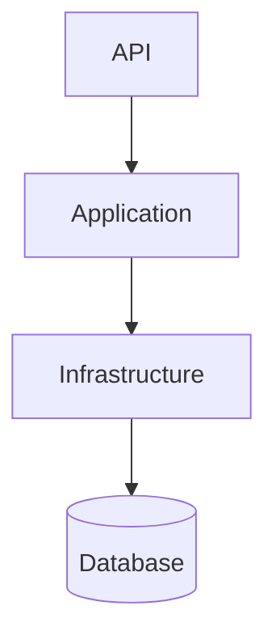

# BookingService - Architecture & Technical Decisions

This document explains the architectural patterns, design decisions, and technical choices made in the BookingService project.

## Solution Architecture

The application follows a **Controller → Application Service → DbContext** flow. There is no separate repository layer: **EF Core** provides Unit of Work and data access. This keeps the stack simple and aligns with many modern .NET architectures (e.g. Vertical Slice). A repository abstraction may be introduced later if the project grows (e.g. multiple data sources or need to swap persistence).

- **API** (BookingService.Api): HTTP endpoints, authentication, global exception handling. The **Worker** (BookingExpiryService) runs in-process as a hosted service.
- **Application** (BookingService.Application): Business logic, service interfaces, DTOs, validators. Uses `BookingDbContext` from Infrastructure.
- **Infrastructure** (BookingService.Infrastructure): EF Core DbContext, configurations, migrations.
- **Core** (BookingService.Core): Domain entities, enums, domain exceptions, options classes.

**Orchestration**: When running with .NET Aspire (AppHost), Aspire starts the API and a SQL Server container and wires configuration (e.g. connection strings, JWT key).

## Layer Responsibilities

| Layer | Project | Responsibility |
|-------|---------|----------------|
| **Presentation** | BookingService.Api | HTTP, auth, request/response, global exception filter (ProblemDetails) |
| **Application** | BookingService.Application | Business logic, services, DTOs, FluentValidation |
| **Domain** | BookingService.Core | Entities, enums, domain exceptions, options |
| **Infrastructure** | BookingService.Infrastructure | DbContext, EF Core, migrations |
| **Worker** | BookingService.Worker | Background expiry of pending bookings (in-process) |
| **Orchestration** | BookingService.AppHost | Aspire host, containers, service wiring |

## Domain and API Contract

### Domain Exceptions

Business and validation failures are expressed with **domain exceptions** so the API can map them to consistent HTTP status codes and **RFC 7807 ProblemDetails**:

| Exception | HTTP | Use |
|-----------|------|-----|
| `NotFoundException` | 404 | Entity not found (user, event, booking, ticket type) |
| `ConflictException` | 409 | Duplicate or conflict (e.g. email already registered) |
| `CapacityExceededException` | 409 | Not enough tickets available |
| `ValidationException` | 400 | Business rule or validation failure |
| `InvalidBookingStateException` | 400 | Invalid state transition (e.g. confirm already cancelled) |
| `UnauthorizedAccessException` | 403 | e.g. cancel another user’s booking |

The global **ProblemDetailsExceptionFilter** in the API maps these (and `DbUpdateConcurrencyException` → 409) to ProblemDetails with `type`, `title`, `detail`, `status`, `instance`, and `traceId`.

### Concurrency

- **RowVersion** on `Booking` and `TicketType` enables optimistic concurrency. When a concurrent update is detected, EF Core throws `DbUpdateConcurrencyException`.
- The API returns **409 Conflict** with a clear message (e.g. “The resource was modified by another request. Please refresh and try again.”). There is **no server-side retry**: the **client** decides whether to refresh and retry or show the conflict to the user.

### DTO Separation

Controllers never expose domain entities. All responses and request bodies use **DTOs** (e.g. `BookingDto`, `CreateBookingRequest`). The Application layer maps between entities and DTOs.

### Logging and Correlation

Structured logging is used at service boundaries (e.g. BookingCreated, BookingConfirmed, BookingCancelled) with properties such as **BookingId**, **UserId**, **EventId**. A **RequestLoggingScopeMiddleware** adds **TraceId** and **RequestId** to the logging scope for each request so logs can be correlated in production.

## Key Architectural Decisions

### 1. Thin Controllers, Rich Services

Controllers handle only HTTP (routing, auth, calling services). All business logic lives in Application services. Exceptions are handled by the global filter; controllers do not catch domain exceptions.

### 2. Strategy Pattern for Policy Decisions

`BookingPolicyService` is separate from `BookingsService`. It evaluates cancellation and refund rules (e.g. refund allowed only if cancelled more than 24h before event). This keeps policy logic testable and easy to change.

### 3. Time Abstraction via ITimeProvider

`ITimeProvider` is injected instead of using `DateTimeOffset.UtcNow` directly. This allows deterministic unit tests for expiry, refund windows, and booking timeout.

### 4. Configuration via IOptions

Strongly-typed options (e.g. `BookingOptions`, `JwtOptions`) are bound from configuration. Timeout, refund cutoff, and expiry poll interval are centralized and testable.

### 5. Optimistic Concurrency with RowVersion

`Booking` and `TicketType` have a `RowVersion` property configured as a concurrency token. This prevents lost updates when two requests update the same booking or ticket type; one receives 409 and can retry or inform the user.

### 6. DTOs for API Boundaries

Entity (Core) → Service (maps to DTO) → Controller → HTTP. The API contract is stable and does not leak domain internals.

## Infrastructure Decisions

### Aspire for Orchestration

Aspire is used for local development and container orchestration: SQL Server container, connection strings, JWT key injection, OpenTelemetry, health checks, and dashboard.

### Secrets via Environment Variables

No secrets in config files. JWT key and DB credentials are provided via environment variables or Aspire parameters (and user-secrets in development).

### Background Service for Booking Expiry

`BookingExpiryService` runs inside the API process as an `IHostedService`. It periodically finds pending bookings past their expiration and releases reserved tickets. For higher scale, this could be moved to a separate worker or message-driven process.

### JWT Bearer Authentication

Stateless JWT tokens for API auth. Short token lifetime and signing key from environment.

### Central Package Management

`Directory.Packages.props` centralizes NuGet package versions across the solution.

## Testing Strategy

- **Unit tests**: Domain entities (Booking, TicketType) and policy (BookingPolicyService) in isolation with mocked time and options.
- **Integration tests**: `BookingsService` with in-memory EF database; tests for create, confirm, cancel, capacity exceeded, and invalid state transitions (e.g. confirm when already cancelled).

## API Features

- **Validation**: FluentValidation for request DTOs; validation errors returned as **400** with ProblemDetails.
- **Pagination**: List endpoints support `?page=1&pageSize=20` (e.g. `/api/bookings`, `/api/events`). Response includes `Items`, `Page`, `PageSize`, `TotalCount`, `TotalPages`, `HasNextPage`, `HasPreviousPage`. Maximum page size is enforced server-side.
- **Security**: Ownership checks (users see only their bookings), role-based authorization (Customer, Organizer, Admin), JWT validation.

## Future Considerations

- **Scalability**: Separate worker for expiry, message queue, or event-driven design.
- **Enhancements**: Caching, API versioning, rate limiting.

## Summary

The architecture prioritizes **maintainability** (clear layers, testable services), **security** (no hardcoded secrets, JWT, ownership checks), **developer experience** (Aspire, documentation), and **reliability** (validation, ProblemDetails, 409 for concurrency, structured logging with correlation).
