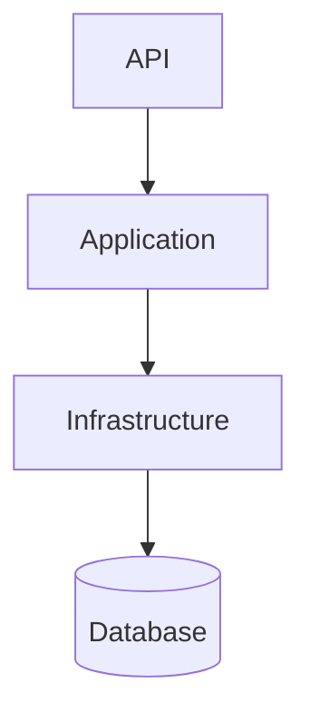

# BookingService

Event ticket booking system built with **ASP.NET Core 9**, **Entity Framework Core**, and **.NET Aspire**.

## Setup summary

1. **Clone** the repository and open the solution.
2. **Set the JWT secret** (required):
   - With Aspire: `$env:Parameters__jwt_key = "YourSecretKey_MinimumLength32Characters!"`
   - Without Aspire: `$env:Jwt__Key = "YourSecretKey_MinimumLength32Characters!"`
3. **Run**:
   - **Option 1 (recommended):** From `BookingService.AppHost`, run `dotnet run`. Aspire starts the API and a SQL Server container; the dashboard opens at `https://localhost:17178`.
   - **Option 2:** From `BookingService.Api`, run `dotnet run`. Uses LocalDB (see connection string in `appsettings.json`).

**Prerequisites:** [.NET 9 SDK](https://dotnet.microsoft.com/download/dotnet/9.0). Docker is required only for Option 1 (Aspire).

**Test users** (seeded in Development):

| Email | Password | Role |
|-------|----------|------|
| admin@bookingservice.com | Password123! | Admin |
| organizer1@bookingservice.com | Password123! | Organizer |
| customer1@bookingservice.com | Password123! | Customer |

---

## Architecture

High-level flow: **API → Application → Infrastructure → Database**. Controllers call Application services; services use EF Core DbContext (no separate repository layer). The booking expiry worker runs in-process as a hosted service.



For full detail (layers, domain exceptions, concurrency, logging, decisions), see **[ARCHITECTURE.md](ARCHITECTURE.md)**.

### Domain entities

- **User**, **Event**, **TicketType**: Users book tickets for events; each event has one or more ticket types with capacity and price.
- **Booking**, **BookingItem**: A booking belongs to a user and an event and contains one or more items (ticket type + quantity). Lifecycle: **Pending** → **Confirmed** or **Cancelled** or **Expired**.
- **Refund**: Created when a confirmed booking is cancelled and a refund is allowed (e.g. more than 24h before event).

---

## API endpoints

### Authentication
- `POST /api/auth/register` – Register
- `POST /api/auth/login` – Login and get JWT

### Events (public)
- `GET /api/events` – List published events (paginated)
- `GET /api/events/{id}` – Event details with ticket availability

### Bookings (authenticated)
- `GET /api/bookings` – List current user’s bookings (paginated)
- `GET /api/bookings/{id}` – Get booking (own only)
- `POST /api/bookings` – Create booking
- `POST /api/bookings/{id}/confirm` – Confirm pending booking
- `POST /api/bookings/{id}/cancel` – Cancel booking (optional reason in body)

### Organizer events (Organizer role)
- `GET /api/organizer/events` – List own events
- `GET /api/organizer/events/{id}` – Get event
- `GET /api/organizer/events/{id}/stats` – Stats (revenue, sales)
- `POST /api/organizer/events` – Create event (Draft)
- `PUT /api/organizer/events/{id}` – Update event
- `POST /api/organizer/events/{id}/publish` – Publish
- `POST /api/organizer/events/{id}/cancel` – Cancel event
- `DELETE /api/organizer/events/{id}` – Delete event

### Users (Admin role)
- `GET /api/users` – List users
- `GET /api/users/{id}` – Get user
- `POST /api/users` – Create user
- `PUT /api/users/{id}` – Update user
- `DELETE /api/users/{id}` – Delete user

### Pagination

List endpoints support query parameters: **`?page=1&pageSize=20`**. Response shape includes `Items`, `Page`, `PageSize`, `TotalCount`, `TotalPages`, `HasNextPage`, `HasPreviousPage`.

### Error format

Errors are returned as **RFC 7807 ProblemDetails** (JSON with `type`, `title`, `detail`, `status`, `instance`, and optional `traceId` / `errorCode`).

| Status | Meaning |
|--------|--------|
| **400** | Validation or business rule failure (e.g. invalid booking state) |
| **403** | Forbidden (e.g. not owner of booking) |
| **404** | Resource not found |
| **409** | Conflict (e.g. concurrency, capacity exceeded, duplicate email) |
| **500** | Server error (detail minimized in production) |

---

## Configuration

### JWT and secrets
- **Aspire:** Set `Parameters__jwt_key` (e.g. via `$env:Parameters__jwt_key`) before running AppHost.
- **Standalone:** Set `Jwt__Key` or use `dotnet user-secrets` in `BookingService.Api`.

### Application settings (e.g. in `appsettings.json`)

| Setting | Default | Description |
|---------|---------|-------------|
| `Booking:TimeoutMinutes` | 15 | Pending booking expiry (minutes) |
| `Booking:RefundCutoffHours` | 24 | Refund allowed only if cancelled more than this many hours before event |
| `Booking:ExpiryPollIntervalMinutes` | 1 | How often the worker checks for expired bookings |
| `Jwt:Issuer` / `Jwt:Audience` / `Jwt:ExpiresInMinutes` | – | JWT token settings |

---

## Development

### Tests
```powershell
cd BookingService
dotnet test
```

### Migrations
Migrations run on startup. To add a new one:
```powershell
dotnet ef migrations add MigrationName --project BookingService.Infrastructure --startup-project BookingService.Api
```

### Health
With Aspire: `/health`, `/alive`. See dashboard for logs and metrics.

---

## Deployment

Use a SQL Server instance and set:

- `ConnectionStrings__BookingDb` – Connection string
- `Jwt__Key` – JWT signing key (min 32 characters)
- `ASPNETCORE_ENVIRONMENT=Production`

A sample `docker-compose.yml` can wire the API and SQL Server; see project docs or ARCHITECTURE.md for production notes.

---

## Troubleshooting

- **JWT Key not configured:** Set the env var or user-secret as above for your run mode (Aspire vs standalone).
- **Docker / SQL:** With Aspire, ensure the SQL container is running (dashboard). Without Docker, use LocalDB and check `appsettings.json` connection string.
- **Port in use:** Adjust ports in `Properties/launchSettings.json` or stop the conflicting app.
